# Cloud-Storage-Setup
AWS S3 Cloud Storage Setup
Internship Task
Create and Configure Cloud Storage using Amazon S3
This project demonstrates the creation, configuration, and secure management of a cloud storage bucket using Amazon S3 on AWS Free Tier.
________________________________________
Step 1: Create an S3 Bucket
  1.	Login to AWS Console
  2.	Navigate to Amazon S3
  3.	Click Create bucket
  4.	Configure:
    o	Bucket Name: your-bucket-name
    o	Region: ap-south-1 (Mumbai)
    o	Block Public Access: ✅ Enabled
  5.	Click Create bucket
 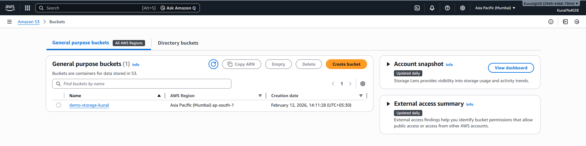
________________________________________
Step 2: Create Folder Structure
  Inside the bucket, created the following folders:
    •	documents/
    •	images/
    •	logs/
This ensures organized storage.
 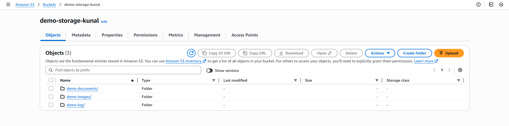
________________________________________
Step 3: Upload Example Files
Uploaded the following files:
  •	1 Text files (.txt)
  •	1 Eg. Log file
  •	1 Image file (.png)
Files were organized into appropriate folders.
 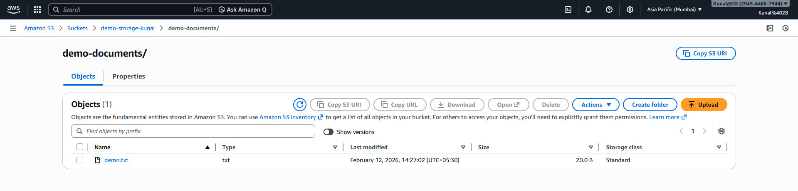
 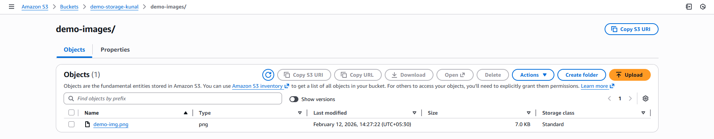
 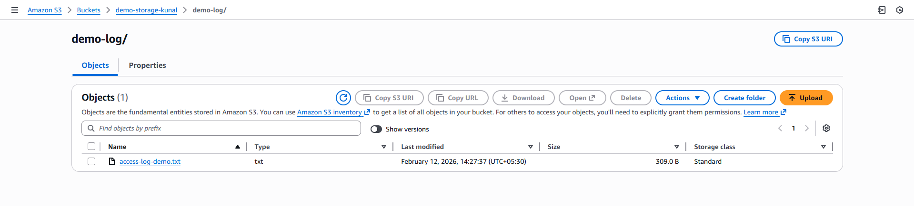
________________________________________
Step 4: Configure Access Permissions
Block Public Access
  •	Verified Block all public access is enabled.
  •	Ensures the bucket remains private.
Object Ownership
  •	Bucket owner enforced (ACLs disabled).
  •	Access controlled using bucket policies & IAM.
 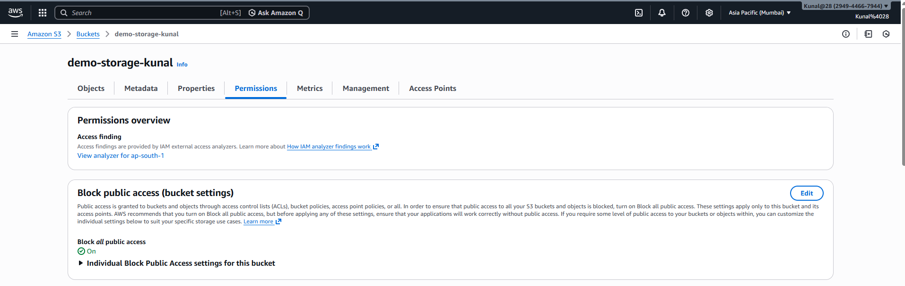
________________________________________
Step 5: Enable Default Encryption
  •	Enabled Server-Side Encryption (SSE-S3)
  •	Ensures data is encrypted at rest.
 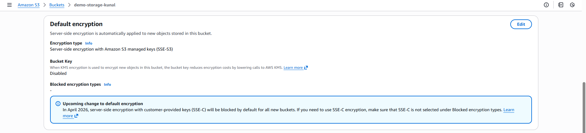
________________________________________
Step 6: Enable Bucket Versioning
  •	Enabled versioning to maintain multiple versions of objects.
  •	Prevents accidental data loss.
 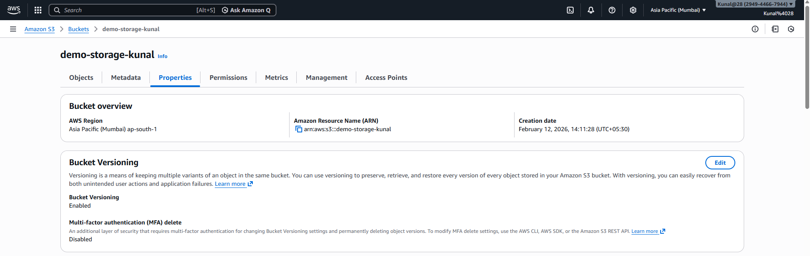
________________________________________
Step 7: Verify Private Access
  1.	Copied Object URL of an uploaded file.
  2.	Opened it in Incognito window.
  3.	Received:
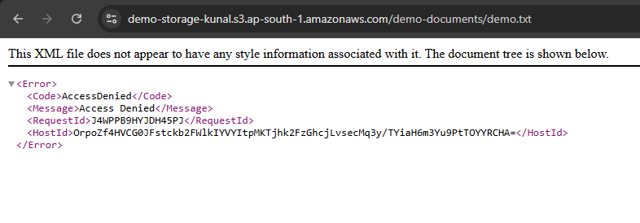
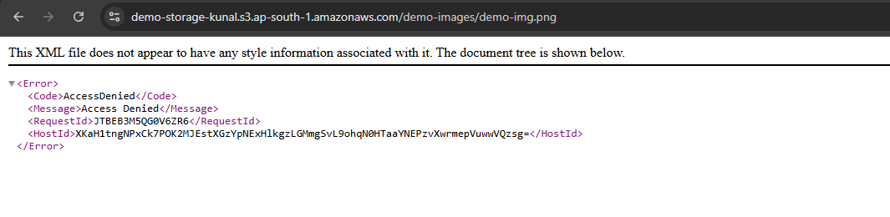
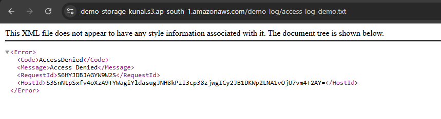

This confirms secure configuration.
________________________________________
Conclusion: 
An Amazon S3 bucket was successfully created and configured with secure access controls. 
Example files were uploaded, encryption and versioning were enabled, and access permissions were validated through an AccessDenied response. 
This setup demonstrates secure and scalable cloud storage implementation using AWS.

